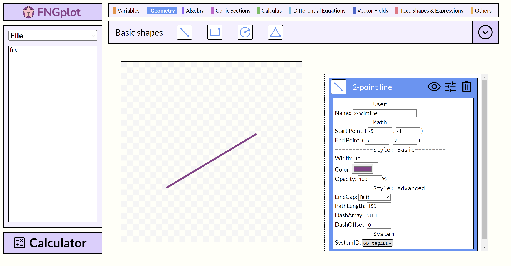

# FNGplot

FNGplot is a *specialized* plotter desgined to help STEM teachers create colorful and precise mathematical diagrams for use in teaching materials and tests.

## About

`FNGplot is currently under development.`

`Scheduled v1.0.0 release date: 2023 Summer`

## Features

- To be added

## Current development progress:

### UI: 

## Developer team
- Main developer: Wei-Hsu Lin(林韋旭) 
- UX tester: Mu-En Chiu (邱沐恩)

## Note
FNGplot is tested on **Chromium 111.0.5513.0**

Support for other browsers is unnecssary as the final software will be based on [Electron](https://github.com/electron/electron).